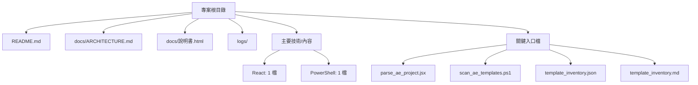

# Project.AE模板智能庫 架構圖

生成時間：2026-07-02 22:37

## 架構總覽

## 主要內容

影像、影片或媒體生產流程。目前偵測到主要內容型態：React, PowerShell。

## 子資料夾

- `logs/`

## 技術/檔案型態

- React: 1 檔
- PowerShell: 1 檔

## 邊界與風險

- 此文件只根據本機檔案結構與非敏感檔名推斷，不讀取或揭露金鑰、token、session、cookie、`.env` 等敏感資料。
- 自動圖只描述目前可見結構；若專案有外部服務、雲端帳號或手動流程，需由後續人工驗收補充。
